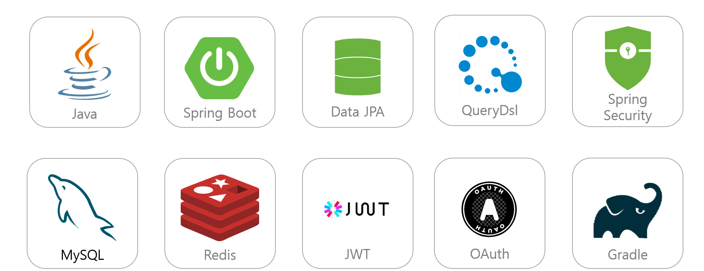
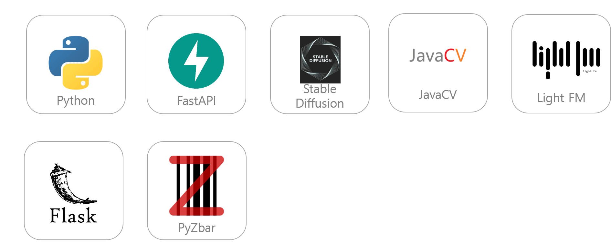
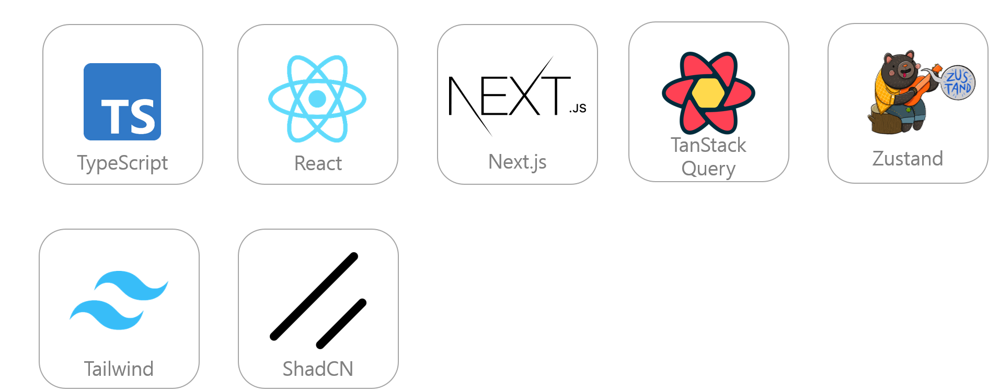
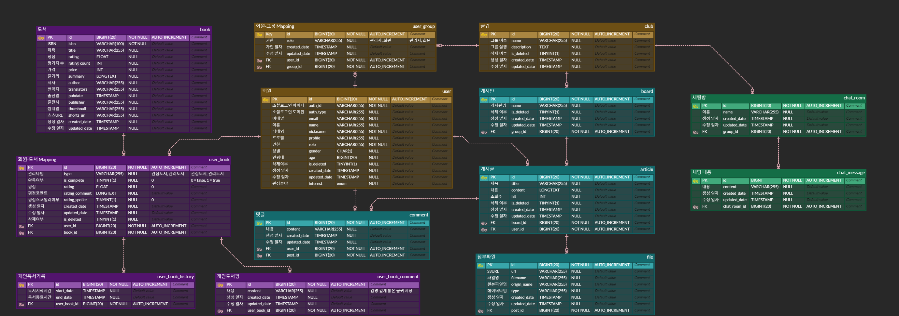
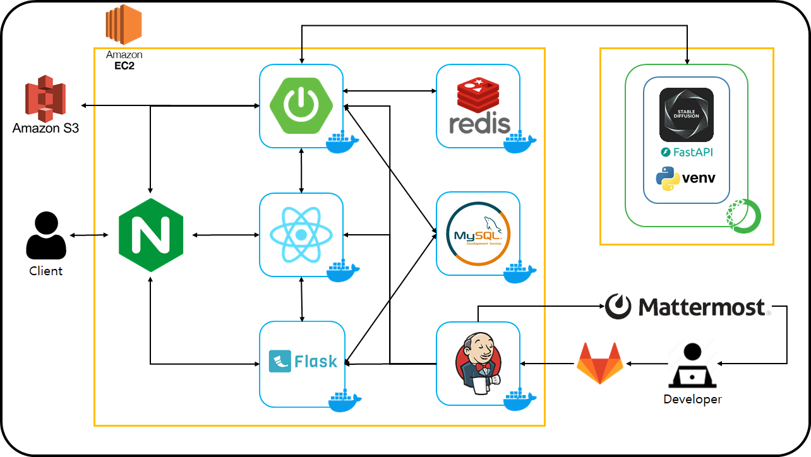

# ⭐️ Libro

> SSAFY 10기 2학기 특화 프로젝트 - Libro <br/> > https://j10a301.p.ssafy.io/

- 기간: 2024.02.19 ~ 2024.04.05
- 주제: 생성형 AI 기반 쇼츠 영상 제작 및 도서 추천 서비스
- 개요: `Libro` 는 책 줄거리를 바탕으로 생성형 AI를 사용하여 쇼츠 영상을 제작하며, 이를 기반으로 사용자에게 도서를 추천해주는 서비스 입니다

## 👐 서비스 소개 👐

### 📕 메인 페이지

사용자별 맞춤형 도서를 쇼츠 형태의 동영상으로 제공해줍니다.


### 🔓 로그인 페이지

카카오, 구글, 네이버 등의 다양한 간편 로그인을 지원합니다.
최초 가입시 사용자 기반 추천을 위하여 추가 데이터를 제공 받습니다.


### 🔍 도서 검색 서비스

저자명, 도서명을 바탕으로 원하는 책을 검색할 수 있습니다.
검색시 해당 책을 읽고 있는 사용자들의 평점과 통계들을 확인 할 수 있습니다.
사용자가 현재 읽고 있거나 관심있는 도서를 등록 할 수 있습니다.


### 👪  커뮤니티 

사용자들끼리 소통할 수 있는 커뮤니티 공간입니다.
자신의 생각을 자유롭게 공유할 수 있습니다.


### 📚 나의 서재


내가 등록한 도서들 관리하는 페이지 입니다.
해당 페이지를 통해 도서의 완독 여부를 관리 할 수 있으며, 마음에 드는 글귀.평점 등을 등록할 수 있습니다. 


### 📃 마이 페이지

마이 페이지에서 나의 회원정보, 해당 유저의 독서 통계를 확인 할 수 있습니다.


## 👐 기술 특이점 👐
<ol>
    <li>Stable Diffusion 을 사용한 이미지 생성</li>
    <li>최소공배수 등의 기법을 활용한 이미지+자막을 합성한 영상 제작</li>
    <li>사용자의 독서 기록 기반 추천 시스템</li>
    <li>pyzbar + React-Camera-Pro 를 사용한 바코드 인식</li>
    <li>OAuth 기반 소셜 로그인</li>
    <li>No-Offset 방식의 쿼리를 통한 조회 성능 개선</li>
    <li>무한 스크롤 기능</li>
</ol>


## 👐 팀원 구성 및 역할 분담👐

<table align="center">
    <tr align="center">
        <td style="width: 250px;">
            <a href="https://github.com/Leeminw">
              
              <br />
              <b>이민우 (팀장)</b>
            </a>
        </td>
        <td style="width: 250px">
            <a href="https://github.com/yeogeru">
              
                <br />
              <b>유지웅 (팀원)</b>
            </a> 
        </td>
         <td style="width: 250px">
            <a href="https://github.com/JoSihun">
              
                <br />
              <b>조시훈 (팀원)</b>
            </a> 
        </td>
        <td style="width: 250px;">
            <a href="https://github.com/KrswJo">
              
              <br />
              <b>조승우 (팀원)</b>
            </a>
        </td>
    </tr>
    <tr align="left">
        <td>
        1. 도서 추천 시스템<br>
        2. 도서 도메인 API<br>
        </td>
        <td>
        1. 소셜 로그인<br>
        2. 메인 페이지<br>
        3. 책 검색 페이지<br>
        </td>
        <td>
        1. DevOps<br>
        2. 생성형 AI 기반 쇼츠 <br>
        3. DB 관리<br>
        </td>
        <td>
        1. 커뮤니티 도메인 API 및 페이지<br>
        2. 마이페이지 <br>
        </td>
    </tr>
</table>

## 👐 프로젝트 산출물 👐

### [기술스택]()

<h2>BackEnd</h2>



<h2>AI / 추천 시스템</h2>



<h2>Front</h2>



<h2>Infra</h2>


### [Figma]()


### [ERD]()

### 


### [API 명세서](https://docs.google.com/spreadsheets/d/1s436dPvQNBRy-j07uLH9vGCNiFMIAVaR/edit#gid=410163342)

### [아키텍처]()



### [포팅 매뉴얼](exec/Porting-Manual.md)

<br/>

## 👐 📦 폴더 구조 👐

<details>
<summary>FE 폴더 구조</summary>
<div markdown="1">

```
📦frontend
 ┣ 📂public
 ┃ ┣ 📜back.svg
 ┃ ┣ 📜BG.svg
 ┃ ┣ 📜bgm00.mp3
 ┃ ┣ 📜bgm01.mp3
 ┃ ┣ 📜bgm02.mp3
 ┃ ┣ 📜bgm03.mp3
 ┃ ┣ 📜bgm04.mp3
 ┃ ┣ 📜bgm05.mp3
 ┃ ┣ 📜bgm06.mp3
 ┃ ┣ 📜bgm07.mp3
 ┃ ┣ 📜bgm08.mp3
 ┃ ┣ 📜bgm09.mp3
 ┃ ┣ 📜book1.svg
 ┃ ┣ 📜book2.svg
 ┃ ┣ 📜book3.svg
 ┃ ┣ 📜book4.svg
 ┃ ┣ 📜book5.svg
 ┃ ┣ 📜calendar.svg
 ┃ ┣ 📜ex00.mp4
 ┃ ┣ 📜google.svg
 ┃ ┣ 📜kakao.svg
 ┃ ┣ 📜left.svg
 ┃ ┣ 📜mdi_pencil.svg
 ┃ ┣ 📜naver.svg
 ┃ ┣ 📜next.svg
 ┃ ┣ 📜right.svg
 ┃ ┣ 📜search1.svg
 ┃ ┣ 📜testImg1.jpg
 ┃ ┣ 📜testImg2.jpg
 ┃ ┣ 📜vector.svg
 ┃ ┣ 📜vercel.svg
 ┃ ┣ 📜x-white.svg
 ┃ ┗ 📜xd.svg
 ┣ 📂src
 ┃ ┣ 📂app
 ┃ ┃ ┣ 📂addinfo
 ┃ ┃ ┃ ┣ 📜data.tsx
 ┃ ┃ ┃ ┗ 📜page.tsx
 ┃ ┃ ┣ 📂club
 ┃ ┃ ┃ ┣ 📂write
 ┃ ┃ ┃ ┃ ┗ 📜page.tsx
 ┃ ┃ ┃ ┣ 📂[id]
 ┃ ┃ ┃ ┃ ┣ 📂@join
 ┃ ┃ ┃ ┃ ┃ ┗ 📜page.tsx
 ┃ ┃ ┃ ┃ ┣ 📂admin
 ┃ ┃ ┃ ┃ ┃ ┣ 📂category
 ┃ ┃ ┃ ┃ ┃ ┃ ┣ 📜layout.tsx
 ┃ ┃ ┃ ┃ ┃ ┃ ┗ 📜page.tsx
 ┃ ┃ ┃ ┃ ┃ ┗ 📂member
 ┃ ┃ ┃ ┃ ┃ ┃ ┣ 📜layout.tsx
 ┃ ┃ ┃ ┃ ┃ ┃ ┗ 📜page.tsx
 ┃ ┃ ┃ ┃ ┣ 📂board
 ┃ ┃ ┃ ┃ ┃ ┣ 📂write
 ┃ ┃ ┃ ┃ ┃ ┃ ┣ 📜layout.tsx
 ┃ ┃ ┃ ┃ ┃ ┃ ┗ 📜page.tsx
 ┃ ┃ ┃ ┃ ┃ ┗ 📂[boardId]
 ┃ ┃ ┃ ┃ ┃ ┃ ┣ 📂edit
 ┃ ┃ ┃ ┃ ┃ ┃ ┃ ┗ 📜page.tsx
 ┃ ┃ ┃ ┃ ┃ ┃ ┗ 📜page.tsx
 ┃ ┃ ┃ ┃ ┣ 📂chatting
 ┃ ┃ ┃ ┃ ┃ ┣ 📜layout.tsx
 ┃ ┃ ┃ ┃ ┃ ┗ 📜page.tsx
 ┃ ┃ ┃ ┃ ┣ 📂edit
 ┃ ┃ ┃ ┃ ┃ ┗ 📜page.tsx
 ┃ ┃ ┃ ┃ ┣ 📂inform
 ┃ ┃ ┃ ┃ ┃ ┗ 📜page.tsx
 ┃ ┃ ┃ ┃ ┣ 📜layout.tsx
 ┃ ┃ ┃ ┃ ┗ 📜page.tsx
 ┃ ┃ ┃ ┗ 📜page.tsx
 ┃ ┃ ┣ 📂detail
 ┃ ┃ ┃ ┗ 📜page.tsx
 ┃ ┃ ┣ 📂library
 ┃ ┃ ┃ ┗ 📜page.tsx
 ┃ ┃ ┣ 📂login
 ┃ ┃ ┃ ┣ 📂loading
 ┃ ┃ ┃ ┃ ┗ 📜page.tsx
 ┃ ┃ ┃ ┗ 📜page.tsx
 ┃ ┃ ┣ 📂mypage
 ┃ ┃ ┃ ┗ 📜page.tsx
 ┃ ┃ ┣ 📂scan
 ┃ ┃ ┃ ┗ 📜page.tsx
 ┃ ┃ ┣ 📂search
 ┃ ┃ ┃ ┣ 📂result
 ┃ ┃ ┃ ┃ ┗ 📜page.tsx
 ┃ ┃ ┃ ┗ 📜page.tsx
 ┃ ┃ ┣ 📂signup
 ┃ ┃ ┃ ┗ 📜page.tsx
 ┃ ┃ ┣ 📂test
 ┃ ┃ ┃ ┣ 📜page.tsx
 ┃ ┃ ┃ ┗ 📜_document.js
 ┃ ┃ ┣ 📂test2
 ┃ ┃ ┃ ┣ 📜page.tsx
 ┃ ┃ ┃ ┗ 📜_document.js
 ┃ ┃ ┣ 📜favicon.ico
 ┃ ┃ ┣ 📜globals.css
 ┃ ┃ ┣ 📜layout.tsx
 ┃ ┃ ┣ 📜page-bak.tsx
 ┃ ┃ ┗ 📜page.tsx
 ┃ ┣ 📂components
 ┃ ┃ ┣ 📂components
 ┃ ┃ ┃ ┣ 📂admin
 ┃ ┃ ┃ ┃ ┣ 📜BoardList.tsx
 ┃ ┃ ┃ ┃ ┣ 📜UserProfile.tsx
 ┃ ┃ ┃ ┃ ┗ 📜UserProfileProvider.tsx
 ┃ ┃ ┃ ┣ 📂board
 ┃ ┃ ┃ ┃ ┣ 📜boardItems.tsx
 ┃ ┃ ┃ ┃ ┣ 📜boardList.tsx
 ┃ ┃ ┃ ┃ ┣ 📜commentList.tsx
 ┃ ┃ ┃ ┃ ┣ 📜communityCard.tsx
 ┃ ┃ ┃ ┃ ┗ 📜titleCard.tsx
 ┃ ┃ ┃ ┣ 📂chat
 ┃ ┃ ┃ ┃ ┣ 📜AnotherUserChat.tsx
 ┃ ┃ ┃ ┃ ┗ 📜MyChat.tsx
 ┃ ┃ ┃ ┣ 📂club
 ┃ ┃ ┃ ┃ ┣ 📜ClubListCard.tsx
 ┃ ┃ ┃ ┃ ┣ 📜FindClubCard.tsx
 ┃ ┃ ┃ ┃ ┣ 📜FindClubCard2.tsx
 ┃ ┃ ┃ ┃ ┗ 📜JoinedClubCard.tsx
 ┃ ┃ ┃ ┣ 📂mypage
 ┃ ┃ ┃ ┃ ┣ 📜calendar.tsx
 ┃ ┃ ┃ ┃ ┣ 📜calendarV2.tsx
 ┃ ┃ ┃ ┃ ┗ 📜mypage.tsx
 ┃ ┃ ┃ ┣ 📂provider
 ┃ ┃ ┃ ┃ ┗ 📜ReactQueryProvider.tsx
 ┃ ┃ ┃ ┣ 📜BarCode.tsx
 ┃ ┃ ┃ ┣ 📜BarCode2.tsx
 ┃ ┃ ┃ ┣ 📜comments.tsx
 ┃ ┃ ┃ ┣ 📜detailAnalyze.tsx
 ┃ ┃ ┃ ┣ 📜detailRating.tsx
 ┃ ┃ ┃ ┣ 📜groupOwner.tsx
 ┃ ┃ ┃ ┗ 📜team-members.tsx
 ┃ ┃ ┣ 📂layout
 ┃ ┃ ┃ ┗ 📜backbar.tsx
 ┃ ┃ ┣ 📂ui
 ┃ ┃ ┃ ┣ 📜accordion.tsx
 ┃ ┃ ┃ ┣ 📜alert-dialog.tsx
 ┃ ┃ ┃ ┣ 📜alert.tsx
 ┃ ┃ ┃ ┣ 📜aspect-ratio.tsx
 ┃ ┃ ┃ ┣ 📜avatar.tsx
 ┃ ┃ ┃ ┣ 📜badge.tsx
 ┃ ┃ ┃ ┣ 📜breadcrumb.tsx
 ┃ ┃ ┃ ┣ 📜button.tsx
 ┃ ┃ ┃ ┣ 📜calendar.tsx
 ┃ ┃ ┃ ┣ 📜card.tsx
 ┃ ┃ ┃ ┣ 📜carousel.tsx
 ┃ ┃ ┃ ┣ 📜checkbox.tsx
 ┃ ┃ ┃ ┣ 📜collapsible.tsx
 ┃ ┃ ┃ ┣ 📜command.tsx
 ┃ ┃ ┃ ┣ 📜context-menu.tsx
 ┃ ┃ ┃ ┣ 📜dialog.tsx
 ┃ ┃ ┃ ┣ 📜drawer.tsx
 ┃ ┃ ┃ ┣ 📜dropdown-menu.tsx
 ┃ ┃ ┃ ┣ 📜form.tsx
 ┃ ┃ ┃ ┣ 📜hover-card.tsx
 ┃ ┃ ┃ ┣ 📜input-otp.tsx
 ┃ ┃ ┃ ┣ 📜input.tsx
 ┃ ┃ ┃ ┣ 📜label.tsx
 ┃ ┃ ┃ ┣ 📜menubar.tsx
 ┃ ┃ ┃ ┣ 📜multiple-selector.tsx
 ┃ ┃ ┃ ┣ 📜navigation-menu.tsx
 ┃ ┃ ┃ ┣ 📜pagination.tsx
 ┃ ┃ ┃ ┣ 📜popover.tsx
 ┃ ┃ ┃ ┣ 📜progress-y.tsx
 ┃ ┃ ┃ ┣ 📜progress.tsx
 ┃ ┃ ┃ ┣ 📜quill.tsx
 ┃ ┃ ┃ ┣ 📜radio-group.tsx
 ┃ ┃ ┃ ┣ 📜resizable.tsx
 ┃ ┃ ┃ ┣ 📜scroll-area.tsx
 ┃ ┃ ┃ ┣ 📜select.tsx
 ┃ ┃ ┃ ┣ 📜separator.tsx
 ┃ ┃ ┃ ┣ 📜sheet.tsx
 ┃ ┃ ┃ ┣ 📜skeleton.tsx
 ┃ ┃ ┃ ┣ 📜slider.tsx
 ┃ ┃ ┃ ┣ 📜sonner.tsx
 ┃ ┃ ┃ ┣ 📜spinner.tsx
 ┃ ┃ ┃ ┣ 📜switch.tsx
 ┃ ┃ ┃ ┣ 📜table.tsx
 ┃ ┃ ┃ ┣ 📜tabs.tsx
 ┃ ┃ ┃ ┣ 📜textarea.tsx
 ┃ ┃ ┃ ┣ 📜toast.tsx
 ┃ ┃ ┃ ┣ 📜toaster.tsx
 ┃ ┃ ┃ ┣ 📜toggle-group.tsx
 ┃ ┃ ┃ ┣ 📜toggle.tsx
 ┃ ┃ ┃ ┣ 📜tooltip.tsx
 ┃ ┃ ┃ ┗ 📜use-toast.ts
 ┃ ┃ ┣ 📜BarcodeScanner.tsx
 ┃ ┃ ┣ 📜BarcodeScannerTest.tsx
 ┃ ┃ ┣ 📜BarcodeScannerTestMk2.tsx
 ┃ ┃ ┣ 📜BottomNavigation.tsx
 ┃ ┃ ┣ 📜Header.tsx
 ┃ ┃ ┣ 📜Shorts.tsx
 ┃ ┃ ┗ 📜SubHeader.tsx
 ┃ ┣ 📂interface
 ┃ ┃ ┣ 📜book.ts
 ┃ ┃ ┣ 📜category.ts
 ┃ ┃ ┣ 📜chat.ts
 ┃ ┃ ┣ 📜community.ts
 ┃ ┃ ┣ 📜joinuser.ts
 ┃ ┃ ┣ 📜myPage.ts
 ┃ ┃ ┣ 📜post.ts
 ┃ ┃ ┗ 📜user.ts
 ┃ ┗ 📂lib
 ┃ ┃ ┣ 📜axiois-mypage.ts
 ┃ ┃ ┣ 📜axios-book.ts
 ┃ ┃ ┣ 📜axios-calendar.ts
 ┃ ┃ ┣ 📜axios-fileupload.ts
 ┃ ┃ ┣ 📜axios-login.ts
 ┃ ┃ ┣ 📜axios-readRatio.ts
 ┃ ┃ ┣ 📜axios-search.ts
 ┃ ┃ ┣ 📜axios-shorts.ts
 ┃ ┃ ┣ 📜axios-userBook.ts
 ┃ ┃ ┣ 📜club.ts
 ┃ ┃ ┣ 📜date-formatter.ts
 ┃ ┃ ┣ 📜dayjs.tsx
 ┃ ┃ ┣ 📜interceptor.ts
 ┃ ┃ ┣ 📜login-state.ts
 ┃ ┃ ┗ 📜utils.ts
 ┣ 📜.env
 ┣ 📜.eslintrc.json
 ┣ 📜.gitignore
 ┣ 📜build-frontend.sh
 ┣ 📜components.json
 ┣ 📜deploy-frontend.sh
 ┣ 📜Dockerfile
 ┣ 📜frontend.iml
 ┣ 📜install-components.bat
 ┣ 📜next-env.d.ts
 ┣ 📜next.config.mjs
 ┣ 📜package-lock.json
 ┣ 📜package.json
 ┣ 📜postcss.config.js
 ┣ 📜README.md
 ┣ 📜tailwind.config.ts
 ┗ 📜tsconfig.json
 ```

</div>
</details>

<details>
<summary>BE 폴더 구조</summary>
<div markdown="1">

```
📦backend
 ┣ 📂src
 ┃ ┣ 📂main
 ┃ ┃ ┣ 📂java
 ┃ ┃ ┃ ┗ 📂com
 ┃ ┃ ┃ ┃ ┗ 📂ssafy
 ┃ ┃ ┃ ┃ ┃ ┗ 📂libro
 ┃ ┃ ┃ ┃ ┃ ┃ ┣ 📂domain
 ┃ ┃ ┃ ┃ ┃ ┃ ┃ ┣ 📂article
 ┃ ┃ ┃ ┃ ┃ ┃ ┃ ┃ ┣ 📂controller
 ┃ ┃ ┃ ┃ ┃ ┃ ┃ ┃ ┃ ┗ 📜ArticleController.java
 ┃ ┃ ┃ ┃ ┃ ┃ ┃ ┃ ┣ 📂dto
 ┃ ┃ ┃ ┃ ┃ ┃ ┃ ┃ ┃ ┣ 📜ArticleCreateRequestDto.java
 ┃ ┃ ┃ ┃ ┃ ┃ ┃ ┃ ┃ ┣ 📜ArticleDetailResponseDto.java
 ┃ ┃ ┃ ┃ ┃ ┃ ┃ ┃ ┃ ┣ 📜ArticleUpdateRequestDto.java
 ┃ ┃ ┃ ┃ ┃ ┃ ┃ ┃ ┃ ┣ 📜BoardCategoryArticlesRequestDto.java
 ┃ ┃ ┃ ┃ ┃ ┃ ┃ ┃ ┃ ┗ 📜BoardCategoryArticlesResponseDto.java
 ┃ ┃ ┃ ┃ ┃ ┃ ┃ ┃ ┣ 📂entity
 ┃ ┃ ┃ ┃ ┃ ┃ ┃ ┃ ┃ ┗ 📜Article.java
 ┃ ┃ ┃ ┃ ┃ ┃ ┃ ┃ ┣ 📂exception
 ┃ ┃ ┃ ┃ ┃ ┃ ┃ ┃ ┃ ┗ 📜ArticleNotFoundException.java
 ┃ ┃ ┃ ┃ ┃ ┃ ┃ ┃ ┣ 📂repository
 ┃ ┃ ┃ ┃ ┃ ┃ ┃ ┃ ┃ ┣ 📜ArticleCustomRepository.java
 ┃ ┃ ┃ ┃ ┃ ┃ ┃ ┃ ┃ ┣ 📜ArticleCustomRepositoryImpl.java
 ┃ ┃ ┃ ┃ ┃ ┃ ┃ ┃ ┃ ┗ 📜ArticleRepository.java
 ┃ ┃ ┃ ┃ ┃ ┃ ┃ ┃ ┗ 📂service
 ┃ ┃ ┃ ┃ ┃ ┃ ┃ ┃ ┃ ┣ 📜ArticleService.java
 ┃ ┃ ┃ ┃ ┃ ┃ ┃ ┃ ┃ ┗ 📜ArticleServiceImpl.java
 ┃ ┃ ┃ ┃ ┃ ┃ ┃ ┣ 📂board
 ┃ ┃ ┃ ┃ ┃ ┃ ┃ ┃ ┣ 📂controller
 ┃ ┃ ┃ ┃ ┃ ┃ ┃ ┃ ┃ ┗ 📜BoardController.java
 ┃ ┃ ┃ ┃ ┃ ┃ ┃ ┃ ┣ 📂dto
 ┃ ┃ ┃ ┃ ┃ ┃ ┃ ┃ ┃ ┣ 📜BoardCreateRequestDto.java
 ┃ ┃ ┃ ┃ ┃ ┃ ┃ ┃ ┃ ┣ 📜BoardResponseDto.java
 ┃ ┃ ┃ ┃ ┃ ┃ ┃ ┃ ┃ ┗ 📜BoardUpdateRequestDto.java
 ┃ ┃ ┃ ┃ ┃ ┃ ┃ ┃ ┣ 📂entity
 ┃ ┃ ┃ ┃ ┃ ┃ ┃ ┃ ┃ ┗ 📜Board.java
 ┃ ┃ ┃ ┃ ┃ ┃ ┃ ┃ ┣ 📂exception
 ┃ ┃ ┃ ┃ ┃ ┃ ┃ ┃ ┃ ┗ 📜BoardNotFoundException.java
 ┃ ┃ ┃ ┃ ┃ ┃ ┃ ┃ ┣ 📂repository
 ┃ ┃ ┃ ┃ ┃ ┃ ┃ ┃ ┃ ┣ 📂custom
 ┃ ┃ ┃ ┃ ┃ ┃ ┃ ┃ ┃ ┃ ┣ 📜BoardSearchRepository.java
 ┃ ┃ ┃ ┃ ┃ ┃ ┃ ┃ ┃ ┃ ┗ 📜BoardSearchRepositoryImpl.java
 ┃ ┃ ┃ ┃ ┃ ┃ ┃ ┃ ┃ ┗ 📜BoardRepository.java
 ┃ ┃ ┃ ┃ ┃ ┃ ┃ ┃ ┗ 📂service
 ┃ ┃ ┃ ┃ ┃ ┃ ┃ ┃ ┃ ┣ 📜BoardService.java
 ┃ ┃ ┃ ┃ ┃ ┃ ┃ ┃ ┃ ┗ 📜BoardServiceImpl.java
 ┃ ┃ ┃ ┃ ┃ ┃ ┃ ┣ 📂book
 ┃ ┃ ┃ ┃ ┃ ┃ ┃ ┃ ┣ 📂controller
 ┃ ┃ ┃ ┃ ┃ ┃ ┃ ┃ ┃ ┗ 📜BookController.java
 ┃ ┃ ┃ ┃ ┃ ┃ ┃ ┃ ┣ 📂dto
 ┃ ┃ ┃ ┃ ┃ ┃ ┃ ┃ ┃ ┣ 📜BookCreateRequestDto.java
 ┃ ┃ ┃ ┃ ┃ ┃ ┃ ┃ ┃ ┣ 📜BookDetailResponseDto.java
 ┃ ┃ ┃ ┃ ┃ ┃ ┃ ┃ ┃ ┣ 📜BookUpdateRequestDto.java
 ┃ ┃ ┃ ┃ ┃ ┃ ┃ ┃ ┃ ┣ 📜NaverAPIResponseItem.java
 ┃ ┃ ┃ ┃ ┃ ┃ ┃ ┃ ┃ ┗ 📜NaverAPIResponseList.java
 ┃ ┃ ┃ ┃ ┃ ┃ ┃ ┃ ┣ 📂entity
 ┃ ┃ ┃ ┃ ┃ ┃ ┃ ┃ ┃ ┗ 📜Book.java
 ┃ ┃ ┃ ┃ ┃ ┃ ┃ ┃ ┣ 📂exception
 ┃ ┃ ┃ ┃ ┃ ┃ ┃ ┃ ┃ ┣ 📜BookAlreadyExistException.java
 ┃ ┃ ┃ ┃ ┃ ┃ ┃ ┃ ┃ ┣ 📜BookNotFoundException.java
 ┃ ┃ ┃ ┃ ┃ ┃ ┃ ┃ ┃ ┗ 📜BookValidationException.java
 ┃ ┃ ┃ ┃ ┃ ┃ ┃ ┃ ┣ 📂handler
 ┃ ┃ ┃ ┃ ┃ ┃ ┃ ┃ ┃ ┗ 📜BookExceptionHandler.java
 ┃ ┃ ┃ ┃ ┃ ┃ ┃ ┃ ┣ 📂repository
 ┃ ┃ ┃ ┃ ┃ ┃ ┃ ┃ ┃ ┗ 📜BookRepository.java
 ┃ ┃ ┃ ┃ ┃ ┃ ┃ ┃ ┗ 📂service
 ┃ ┃ ┃ ┃ ┃ ┃ ┃ ┃ ┃ ┣ 📜BookService.java
 ┃ ┃ ┃ ┃ ┃ ┃ ┃ ┃ ┃ ┣ 📜BookServiceImpl.java
 ┃ ┃ ┃ ┃ ┃ ┃ ┃ ┃ ┃ ┣ 📜NaverBookAPIService.java
 ┃ ┃ ┃ ┃ ┃ ┃ ┃ ┃ ┃ ┗ 📜NaverBookAPIServiceImpl.java
 ┃ ┃ ┃ ┃ ┃ ┃ ┃ ┣ 📂club
 ┃ ┃ ┃ ┃ ┃ ┃ ┃ ┃ ┣ 📂controller
 ┃ ┃ ┃ ┃ ┃ ┃ ┃ ┃ ┃ ┗ 📜ClubController.java
 ┃ ┃ ┃ ┃ ┃ ┃ ┃ ┃ ┣ 📂dto
 ┃ ┃ ┃ ┃ ┃ ┃ ┃ ┃ ┃ ┣ 📜ClubCreateRequestDto.java
 ┃ ┃ ┃ ┃ ┃ ┃ ┃ ┃ ┃ ┗ 📜ClubUpdateRequestDto.java
 ┃ ┃ ┃ ┃ ┃ ┃ ┃ ┃ ┣ 📂entity
 ┃ ┃ ┃ ┃ ┃ ┃ ┃ ┃ ┃ ┗ 📜Club.java
 ┃ ┃ ┃ ┃ ┃ ┃ ┃ ┃ ┣ 📂exception
 ┃ ┃ ┃ ┃ ┃ ┃ ┃ ┃ ┃ ┗ 📜ClubNotFoundException.java
 ┃ ┃ ┃ ┃ ┃ ┃ ┃ ┃ ┣ 📂repository
 ┃ ┃ ┃ ┃ ┃ ┃ ┃ ┃ ┃ ┗ 📜ClubRepository.java
 ┃ ┃ ┃ ┃ ┃ ┃ ┃ ┃ ┗ 📂service
 ┃ ┃ ┃ ┃ ┃ ┃ ┃ ┃ ┃ ┣ 📜ClubService.java
 ┃ ┃ ┃ ┃ ┃ ┃ ┃ ┃ ┃ ┗ 📜ClubServiceImpl.java
 ┃ ┃ ┃ ┃ ┃ ┃ ┃ ┣ 📂comment
 ┃ ┃ ┃ ┃ ┃ ┃ ┃ ┃ ┣ 📂controller
 ┃ ┃ ┃ ┃ ┃ ┃ ┃ ┃ ┃ ┗ 📜CommentController.java
 ┃ ┃ ┃ ┃ ┃ ┃ ┃ ┃ ┣ 📂dto
 ┃ ┃ ┃ ┃ ┃ ┃ ┃ ┃ ┃ ┣ 📜CommentCreateRequestDto.java
 ┃ ┃ ┃ ┃ ┃ ┃ ┃ ┃ ┃ ┣ 📜CommentDetailResponseDto.java
 ┃ ┃ ┃ ┃ ┃ ┃ ┃ ┃ ┃ ┗ 📜CommentUpdateRequestDto.java
 ┃ ┃ ┃ ┃ ┃ ┃ ┃ ┃ ┣ 📂entity
 ┃ ┃ ┃ ┃ ┃ ┃ ┃ ┃ ┃ ┗ 📜Comment.java
 ┃ ┃ ┃ ┃ ┃ ┃ ┃ ┃ ┣ 📂exception
 ┃ ┃ ┃ ┃ ┃ ┃ ┃ ┃ ┃ ┗ 📜CommentNotFoundException.java
 ┃ ┃ ┃ ┃ ┃ ┃ ┃ ┃ ┣ 📂repository
 ┃ ┃ ┃ ┃ ┃ ┃ ┃ ┃ ┃ ┣ 📜CommentCustomRepository.java
 ┃ ┃ ┃ ┃ ┃ ┃ ┃ ┃ ┃ ┣ 📜CommentCustomRepositoryImpl.java
 ┃ ┃ ┃ ┃ ┃ ┃ ┃ ┃ ┃ ┗ 📜CommentRepository.java
 ┃ ┃ ┃ ┃ ┃ ┃ ┃ ┃ ┗ 📂service
 ┃ ┃ ┃ ┃ ┃ ┃ ┃ ┃ ┃ ┣ 📜CommentService.java
 ┃ ┃ ┃ ┃ ┃ ┃ ┃ ┃ ┃ ┗ 📜CommentServiceImpl.java
 ┃ ┃ ┃ ┃ ┃ ┃ ┃ ┣ 📂shorts
 ┃ ┃ ┃ ┃ ┃ ┃ ┃ ┃ ┣ 📂controller
 ┃ ┃ ┃ ┃ ┃ ┃ ┃ ┃ ┃ ┣ 📜PromptController.java
 ┃ ┃ ┃ ┃ ┃ ┃ ┃ ┃ ┃ ┣ 📜ShortsController.java
 ┃ ┃ ┃ ┃ ┃ ┃ ┃ ┃ ┃ ┗ 📜TaskController.java
 ┃ ┃ ┃ ┃ ┃ ┃ ┃ ┃ ┣ 📂dto
 ┃ ┃ ┃ ┃ ┃ ┃ ┃ ┃ ┃ ┣ 📜DiffusionRequestDto.java
 ┃ ┃ ┃ ┃ ┃ ┃ ┃ ┃ ┃ ┣ 📜DiffusionResponseDto.java
 ┃ ┃ ┃ ┃ ┃ ┃ ┃ ┃ ┃ ┣ 📜PromptRequestDto.java
 ┃ ┃ ┃ ┃ ┃ ┃ ┃ ┃ ┃ ┣ 📜PromptResponseDto.java
 ┃ ┃ ┃ ┃ ┃ ┃ ┃ ┃ ┃ ┣ 📜ShortsRequestDto.java
 ┃ ┃ ┃ ┃ ┃ ┃ ┃ ┃ ┃ ┣ 📜ShortsResponseDto.java
 ┃ ┃ ┃ ┃ ┃ ┃ ┃ ┃ ┃ ┣ 📜TaskRequestDto.java
 ┃ ┃ ┃ ┃ ┃ ┃ ┃ ┃ ┃ ┗ 📜TaskResponseDto.java
 ┃ ┃ ┃ ┃ ┃ ┃ ┃ ┃ ┣ 📂entity
 ┃ ┃ ┃ ┃ ┃ ┃ ┃ ┃ ┃ ┗ 📜Task.java
 ┃ ┃ ┃ ┃ ┃ ┃ ┃ ┃ ┣ 📂exception
 ┃ ┃ ┃ ┃ ┃ ┃ ┃ ┃ ┃ ┣ 📜TaskNotFoundException.java
 ┃ ┃ ┃ ┃ ┃ ┃ ┃ ┃ ┃ ┗ 📜TaskValidationException.java
 ┃ ┃ ┃ ┃ ┃ ┃ ┃ ┃ ┣ 📂handler
 ┃ ┃ ┃ ┃ ┃ ┃ ┃ ┃ ┃ ┗ 📜TaskExceptionHandler.java
 ┃ ┃ ┃ ┃ ┃ ┃ ┃ ┃ ┣ 📂repository
 ┃ ┃ ┃ ┃ ┃ ┃ ┃ ┃ ┃ ┣ 📜TaskJpaRepository.java
 ┃ ┃ ┃ ┃ ┃ ┃ ┃ ┃ ┃ ┗ 📜TaskRedisRepository.java
 ┃ ┃ ┃ ┃ ┃ ┃ ┃ ┃ ┗ 📂service
 ┃ ┃ ┃ ┃ ┃ ┃ ┃ ┃ ┃ ┣ 📜PromptService.java
 ┃ ┃ ┃ ┃ ┃ ┃ ┃ ┃ ┃ ┣ 📜PromptServiceImpl.java
 ┃ ┃ ┃ ┃ ┃ ┃ ┃ ┃ ┃ ┣ 📜ShortsService.java
 ┃ ┃ ┃ ┃ ┃ ┃ ┃ ┃ ┃ ┣ 📜ShortsServiceImpl.java
 ┃ ┃ ┃ ┃ ┃ ┃ ┃ ┃ ┃ ┣ 📜TaskService.java
 ┃ ┃ ┃ ┃ ┃ ┃ ┃ ┃ ┃ ┗ 📜TaskServiceImpl.java
 ┃ ┃ ┃ ┃ ┃ ┃ ┃ ┣ 📂user
 ┃ ┃ ┃ ┃ ┃ ┃ ┃ ┃ ┣ 📂controller
 ┃ ┃ ┃ ┃ ┃ ┃ ┃ ┃ ┃ ┗ 📜UserController.java
 ┃ ┃ ┃ ┃ ┃ ┃ ┃ ┃ ┣ 📂dto
 ┃ ┃ ┃ ┃ ┃ ┃ ┃ ┃ ┃ ┣ 📜OAuthUser.java
 ┃ ┃ ┃ ┃ ┃ ┃ ┃ ┃ ┃ ┣ 📜UserDetailResponseDto.java
 ┃ ┃ ┃ ┃ ┃ ┃ ┃ ┃ ┃ ┣ 📜UserJoinRequestDto.java
 ┃ ┃ ┃ ┃ ┃ ┃ ┃ ┃ ┃ ┗ 📜UserProfileEditRequestDto.java
 ┃ ┃ ┃ ┃ ┃ ┃ ┃ ┃ ┣ 📂entity
 ┃ ┃ ┃ ┃ ┃ ┃ ┃ ┃ ┃ ┣ 📜Role.java
 ┃ ┃ ┃ ┃ ┃ ┃ ┃ ┃ ┃ ┗ 📜User.java
 ┃ ┃ ┃ ┃ ┃ ┃ ┃ ┃ ┣ 📂exception
 ┃ ┃ ┃ ┃ ┃ ┃ ┃ ┃ ┃ ┗ 📜UserNotFoundException.java
 ┃ ┃ ┃ ┃ ┃ ┃ ┃ ┃ ┣ 📂repository
 ┃ ┃ ┃ ┃ ┃ ┃ ┃ ┃ ┃ ┗ 📜UserRepository.java
 ┃ ┃ ┃ ┃ ┃ ┃ ┃ ┃ ┗ 📂service
 ┃ ┃ ┃ ┃ ┃ ┃ ┃ ┃ ┃ ┣ 📜UserService.java
 ┃ ┃ ┃ ┃ ┃ ┃ ┃ ┃ ┃ ┗ 📜UserServiceImpl.java
 ┃ ┃ ┃ ┃ ┃ ┃ ┃ ┣ 📂userbook
 ┃ ┃ ┃ ┃ ┃ ┃ ┃ ┃ ┣ 📂controller
 ┃ ┃ ┃ ┃ ┃ ┃ ┃ ┃ ┃ ┗ 📜UserBookController.java
 ┃ ┃ ┃ ┃ ┃ ┃ ┃ ┃ ┣ 📂dto
 ┃ ┃ ┃ ┃ ┃ ┃ ┃ ┃ ┃ ┣ 📜UserBookDateRequestDto.java
 ┃ ┃ ┃ ┃ ┃ ┃ ┃ ┃ ┃ ┣ 📜UserBookDetailResponseDto.java
 ┃ ┃ ┃ ┃ ┃ ┃ ┃ ┃ ┃ ┣ 📜UserBookListByDateResponseDto.java
 ┃ ┃ ┃ ┃ ┃ ┃ ┃ ┃ ┃ ┣ 📜UserBookListResponseDto.java
 ┃ ┃ ┃ ┃ ┃ ┃ ┃ ┃ ┃ ┣ 📜UserBookMappingRequestDto.java
 ┃ ┃ ┃ ┃ ┃ ┃ ┃ ┃ ┃ ┣ 📜UserBookRatingRequestDto.java
 ┃ ┃ ┃ ┃ ┃ ┃ ┃ ┃ ┃ ┣ 📜UserBookRatingResponseDto.java
 ┃ ┃ ┃ ┃ ┃ ┃ ┃ ┃ ┃ ┣ 📜UserBookRatingSummary.java
 ┃ ┃ ┃ ┃ ┃ ┃ ┃ ┃ ┃ ┣ 📜UserBookRatioResponseDto.java
 ┃ ┃ ┃ ┃ ┃ ┃ ┃ ┃ ┃ ┣ 📜UserBookTypeUpdateRequestDto.java
 ┃ ┃ ┃ ┃ ┃ ┃ ┃ ┃ ┃ ┣ 📜UserBookUpdateRequestDto.java
 ┃ ┃ ┃ ┃ ┃ ┃ ┃ ┃ ┃ ┣ 📜UserCommentListResponseDto.java
 ┃ ┃ ┃ ┃ ┃ ┃ ┃ ┃ ┃ ┗ 📜UserGenderAgeCountResponseDto.java
 ┃ ┃ ┃ ┃ ┃ ┃ ┃ ┃ ┣ 📂entity
 ┃ ┃ ┃ ┃ ┃ ┃ ┃ ┃ ┃ ┗ 📜UserBook.java
 ┃ ┃ ┃ ┃ ┃ ┃ ┃ ┃ ┣ 📂exception
 ┃ ┃ ┃ ┃ ┃ ┃ ┃ ┃ ┃ ┣ 📜NotReadBookException.java
 ┃ ┃ ┃ ┃ ┃ ┃ ┃ ┃ ┃ ┣ 📜UserBookNotFoundException.java
 ┃ ┃ ┃ ┃ ┃ ┃ ┃ ┃ ┃ ┗ 📜UserBookValidationException.java
 ┃ ┃ ┃ ┃ ┃ ┃ ┃ ┃ ┣ 📂handler
 ┃ ┃ ┃ ┃ ┃ ┃ ┃ ┃ ┃ ┗ 📜UserBookExceptionHandler.java
 ┃ ┃ ┃ ┃ ┃ ┃ ┃ ┃ ┣ 📂repository
 ┃ ┃ ┃ ┃ ┃ ┃ ┃ ┃ ┃ ┣ 📂custom
 ┃ ┃ ┃ ┃ ┃ ┃ ┃ ┃ ┃ ┃ ┣ 📜UserBookCustomRepository.java
 ┃ ┃ ┃ ┃ ┃ ┃ ┃ ┃ ┃ ┃ ┗ 📜UserBookCustomRepositoryImpl.java
 ┃ ┃ ┃ ┃ ┃ ┃ ┃ ┃ ┃ ┗ 📜UserBookRepository.java
 ┃ ┃ ┃ ┃ ┃ ┃ ┃ ┃ ┗ 📂service
 ┃ ┃ ┃ ┃ ┃ ┃ ┃ ┃ ┃ ┣ 📜UserBookService.java
 ┃ ┃ ┃ ┃ ┃ ┃ ┃ ┃ ┃ ┗ 📜UserBookServiceImpl.java
 ┃ ┃ ┃ ┃ ┃ ┃ ┃ ┣ 📂userbookcomment
 ┃ ┃ ┃ ┃ ┃ ┃ ┃ ┃ ┣ 📂controller
 ┃ ┃ ┃ ┃ ┃ ┃ ┃ ┃ ┃ ┗ 📜UserBookCommentController.java
 ┃ ┃ ┃ ┃ ┃ ┃ ┃ ┃ ┣ 📂dto
 ┃ ┃ ┃ ┃ ┃ ┃ ┃ ┃ ┃ ┣ 📜UserBookCommentCreateRequestDto.java
 ┃ ┃ ┃ ┃ ┃ ┃ ┃ ┃ ┃ ┣ 📜UserBookCommentDetailResponseDto.java
 ┃ ┃ ┃ ┃ ┃ ┃ ┃ ┃ ┃ ┗ 📜UserBookCommentUpdateRequestDto.java
 ┃ ┃ ┃ ┃ ┃ ┃ ┃ ┃ ┣ 📂entity
 ┃ ┃ ┃ ┃ ┃ ┃ ┃ ┃ ┃ ┗ 📜UserBookComment.java
 ┃ ┃ ┃ ┃ ┃ ┃ ┃ ┃ ┣ 📂exception
 ┃ ┃ ┃ ┃ ┃ ┃ ┃ ┃ ┃ ┣ 📜UserBookCommentNotFoundException.java
 ┃ ┃ ┃ ┃ ┃ ┃ ┃ ┃ ┃ ┗ 📜UserBookCommentValidationException.java
 ┃ ┃ ┃ ┃ ┃ ┃ ┃ ┃ ┣ 📂handler
 ┃ ┃ ┃ ┃ ┃ ┃ ┃ ┃ ┃ ┗ 📜UserBookCommentExceptionHandler.java
 ┃ ┃ ┃ ┃ ┃ ┃ ┃ ┃ ┣ 📂repository
 ┃ ┃ ┃ ┃ ┃ ┃ ┃ ┃ ┃ ┗ 📜UserBookCommentRepository.java
 ┃ ┃ ┃ ┃ ┃ ┃ ┃ ┃ ┗ 📂service
 ┃ ┃ ┃ ┃ ┃ ┃ ┃ ┃ ┃ ┣ 📜UserBookCommentService.java
 ┃ ┃ ┃ ┃ ┃ ┃ ┃ ┃ ┃ ┗ 📜UserBookCommentsServiceImpl.java
 ┃ ┃ ┃ ┃ ┃ ┃ ┃ ┣ 📂userbookhistory
 ┃ ┃ ┃ ┃ ┃ ┃ ┃ ┃ ┣ 📂controller
 ┃ ┃ ┃ ┃ ┃ ┃ ┃ ┃ ┃ ┗ 📜UserBookHistoryController.java
 ┃ ┃ ┃ ┃ ┃ ┃ ┃ ┃ ┣ 📂dto
 ┃ ┃ ┃ ┃ ┃ ┃ ┃ ┃ ┃ ┣ 📜UserBookHistoryCreateRequestDto.java
 ┃ ┃ ┃ ┃ ┃ ┃ ┃ ┃ ┃ ┣ 📜UserBookHistoryDetailResponseDto.java
 ┃ ┃ ┃ ┃ ┃ ┃ ┃ ┃ ┃ ┗ 📜UserBookHistoryUpdateRequestDto.java
 ┃ ┃ ┃ ┃ ┃ ┃ ┃ ┃ ┣ 📂entity
 ┃ ┃ ┃ ┃ ┃ ┃ ┃ ┃ ┃ ┗ 📜UserBookHistory.java
 ┃ ┃ ┃ ┃ ┃ ┃ ┃ ┃ ┣ 📂exception
 ┃ ┃ ┃ ┃ ┃ ┃ ┃ ┃ ┃ ┣ 📜UserBookHistoryNotFoundException.java
 ┃ ┃ ┃ ┃ ┃ ┃ ┃ ┃ ┃ ┗ 📜UserBookHistoryValidationException.java
 ┃ ┃ ┃ ┃ ┃ ┃ ┃ ┃ ┣ 📂handler
 ┃ ┃ ┃ ┃ ┃ ┃ ┃ ┃ ┃ ┗ 📜UserBookHistoryExceptionHandler.java
 ┃ ┃ ┃ ┃ ┃ ┃ ┃ ┃ ┣ 📂repository
 ┃ ┃ ┃ ┃ ┃ ┃ ┃ ┃ ┃ ┗ 📜UserBookHistoryRepository.java
 ┃ ┃ ┃ ┃ ┃ ┃ ┃ ┃ ┗ 📂service
 ┃ ┃ ┃ ┃ ┃ ┃ ┃ ┃ ┃ ┣ 📜UserBookHistoryService.java
 ┃ ┃ ┃ ┃ ┃ ┃ ┃ ┃ ┃ ┗ 📜UserBookHistoryServiceImpl.java
 ┃ ┃ ┃ ┃ ┃ ┃ ┃ ┗ 📂usergroup
 ┃ ┃ ┃ ┃ ┃ ┃ ┃ ┃ ┣ 📂controller
 ┃ ┃ ┃ ┃ ┃ ┃ ┃ ┃ ┃ ┗ 📜UserGroupController.java
 ┃ ┃ ┃ ┃ ┃ ┃ ┃ ┃ ┣ 📂dto
 ┃ ┃ ┃ ┃ ┃ ┃ ┃ ┃ ┃ ┣ 📜ClubDetailResponseDto.java
 ┃ ┃ ┃ ┃ ┃ ┃ ┃ ┃ ┃ ┣ 📜ClubJoinClubRequestDto.java
 ┃ ┃ ┃ ┃ ┃ ┃ ┃ ┃ ┃ ┣ 📜ClubListDetailRequestDto.java
 ┃ ┃ ┃ ┃ ┃ ┃ ┃ ┃ ┃ ┣ 📜ClubListDetailResponseDto.java
 ┃ ┃ ┃ ┃ ┃ ┃ ┃ ┃ ┃ ┣ 📜ClubMemberDetailResponseDto.java
 ┃ ┃ ┃ ┃ ┃ ┃ ┃ ┃ ┃ ┣ 📜ClubMemberShipResponseDto.java
 ┃ ┃ ┃ ┃ ┃ ┃ ┃ ┃ ┃ ┣ 📜ClubSummaryResponseDto.java
 ┃ ┃ ┃ ┃ ┃ ┃ ┃ ┃ ┃ ┣ 📜MyClubRequestDto.java
 ┃ ┃ ┃ ┃ ┃ ┃ ┃ ┃ ┃ ┗ 📜MyClubResponseDto.java
 ┃ ┃ ┃ ┃ ┃ ┃ ┃ ┃ ┣ 📂entity
 ┃ ┃ ┃ ┃ ┃ ┃ ┃ ┃ ┃ ┣ 📜ClubRole.java
 ┃ ┃ ┃ ┃ ┃ ┃ ┃ ┃ ┃ ┗ 📜UserGroup.java
 ┃ ┃ ┃ ┃ ┃ ┃ ┃ ┃ ┣ 📂exception
 ┃ ┃ ┃ ┃ ┃ ┃ ┃ ┃ ┃ ┣ 📜AlreadyJoinedException.java
 ┃ ┃ ┃ ┃ ┃ ┃ ┃ ┃ ┃ ┗ 📜NotFoundJoinException.java
 ┃ ┃ ┃ ┃ ┃ ┃ ┃ ┃ ┣ 📂repository
 ┃ ┃ ┃ ┃ ┃ ┃ ┃ ┃ ┃ ┣ 📜UserGroupCustomRepository.java
 ┃ ┃ ┃ ┃ ┃ ┃ ┃ ┃ ┃ ┣ 📜UserGroupCustomRepositoryImpl.java
 ┃ ┃ ┃ ┃ ┃ ┃ ┃ ┃ ┃ ┗ 📜UserGroupRepository.java
 ┃ ┃ ┃ ┃ ┃ ┃ ┃ ┃ ┗ 📂service
 ┃ ┃ ┃ ┃ ┃ ┃ ┃ ┃ ┃ ┣ 📜UserGroupService.java
 ┃ ┃ ┃ ┃ ┃ ┃ ┃ ┃ ┃ ┗ 📜UserGroupServiceImpl.java
 ┃ ┃ ┃ ┃ ┃ ┃ ┣ 📂global
 ┃ ┃ ┃ ┃ ┃ ┃ ┃ ┣ 📂auth
 ┃ ┃ ┃ ┃ ┃ ┃ ┃ ┃ ┣ 📂config
 ┃ ┃ ┃ ┃ ┃ ┃ ┃ ┃ ┃ ┗ 📜SecurityConfig.java
 ┃ ┃ ┃ ┃ ┃ ┃ ┃ ┃ ┣ 📂controller
 ┃ ┃ ┃ ┃ ┃ ┃ ┃ ┃ ┃ ┗ 📜TokenController.java
 ┃ ┃ ┃ ┃ ┃ ┃ ┃ ┃ ┣ 📂entity
 ┃ ┃ ┃ ┃ ┃ ┃ ┃ ┃ ┃ ┗ 📜JwtProvider.java
 ┃ ┃ ┃ ┃ ┃ ┃ ┃ ┃ ┣ 📂filter
 ┃ ┃ ┃ ┃ ┃ ┃ ┃ ┃ ┃ ┣ 📜CustomCorsFilter.java
 ┃ ┃ ┃ ┃ ┃ ┃ ┃ ┃ ┃ ┗ 📜JwtAuthorizationFilter.java
 ┃ ┃ ┃ ┃ ┃ ┃ ┃ ┃ ┗ 📂service
 ┃ ┃ ┃ ┃ ┃ ┃ ┃ ┃ ┃ ┗ 📜RefreshTokenService.java
 ┃ ┃ ┃ ┃ ┃ ┃ ┃ ┣ 📂common
 ┃ ┃ ┃ ┃ ┃ ┃ ┃ ┃ ┗ 📜ResponseData.java
 ┃ ┃ ┃ ┃ ┃ ┃ ┃ ┣ 📂config
 ┃ ┃ ┃ ┃ ┃ ┃ ┃ ┃ ┣ 📜CorsConfig.java
 ┃ ┃ ┃ ┃ ┃ ┃ ┃ ┃ ┣ 📜MvcConfig.java
 ┃ ┃ ┃ ┃ ┃ ┃ ┃ ┃ ┣ 📜QueryDslConfig.java
 ┃ ┃ ┃ ┃ ┃ ┃ ┃ ┃ ┣ 📜RedisConfig.java
 ┃ ┃ ┃ ┃ ┃ ┃ ┃ ┃ ┗ 📜S3Config.java
 ┃ ┃ ┃ ┃ ┃ ┃ ┃ ┣ 📂exceptions
 ┃ ┃ ┃ ┃ ┃ ┃ ┃ ┃ ┣ 📜CustomNotFoundException.java
 ┃ ┃ ┃ ┃ ┃ ┃ ┃ ┃ ┗ 📜CustomValidationException.java
 ┃ ┃ ┃ ┃ ┃ ┃ ┃ ┣ 📂fileupload
 ┃ ┃ ┃ ┃ ┃ ┃ ┃ ┃ ┣ 📂controller
 ┃ ┃ ┃ ┃ ┃ ┃ ┃ ┃ ┃ ┗ 📜FileUploadController.java
 ┃ ┃ ┃ ┃ ┃ ┃ ┃ ┃ ┣ 📂dto
 ┃ ┃ ┃ ┃ ┃ ┃ ┃ ┃ ┃ ┗ 📜FileUploadResponseDto.java
 ┃ ┃ ┃ ┃ ┃ ┃ ┃ ┃ ┗ 📂service
 ┃ ┃ ┃ ┃ ┃ ┃ ┃ ┃ ┃ ┣ 📜FileUploadService.java
 ┃ ┃ ┃ ┃ ┃ ┃ ┃ ┃ ┃ ┗ 📜FileUploadServiceImpl.java
 ┃ ┃ ┃ ┃ ┃ ┃ ┃ ┣ 📂handlers
 ┃ ┃ ┃ ┃ ┃ ┃ ┃ ┃ ┣ 📜CustomExceptionHandler.java
 ┃ ┃ ┃ ┃ ┃ ┃ ┃ ┃ ┗ 📜GlobalExceptionHandler.java
 ┃ ┃ ┃ ┃ ┃ ┃ ┃ ┣ 📂oauth
 ┃ ┃ ┃ ┃ ┃ ┃ ┃ ┃ ┣ 📂entity
 ┃ ┃ ┃ ┃ ┃ ┃ ┃ ┃ ┃ ┣ 📜OAuth2UserImpl.java
 ┃ ┃ ┃ ┃ ┃ ┃ ┃ ┃ ┃ ┗ 📜OAuthAttributes.java
 ┃ ┃ ┃ ┃ ┃ ┃ ┃ ┃ ┣ 📂filter
 ┃ ┃ ┃ ┃ ┃ ┃ ┃ ┃ ┃ ┣ 📜OAuth2LoginFailureHandler.java
 ┃ ┃ ┃ ┃ ┃ ┃ ┃ ┃ ┃ ┗ 📜OAuth2LoginSuccessHandler.java
 ┃ ┃ ┃ ┃ ┃ ┃ ┃ ┃ ┗ 📂service
 ┃ ┃ ┃ ┃ ┃ ┃ ┃ ┃ ┃ ┗ 📜CustomOAuth2UserService.java
 ┃ ┃ ┃ ┃ ┃ ┃ ┃ ┗ 📂util
 ┃ ┃ ┃ ┃ ┃ ┃ ┃ ┃ ┗ 📂entity
 ┃ ┃ ┃ ┃ ┃ ┃ ┃ ┃ ┃ ┣ 📜Response.java
 ┃ ┃ ┃ ┃ ┃ ┃ ┃ ┃ ┃ ┗ 📜StringListConverter.java
 ┃ ┃ ┃ ┃ ┃ ┃ ┗ 📜LibroApplication.java
 ┃ ┃ ┗ 📂resources
 ┃ ┃ ┃ ┣ 📂static
 ┃ ┃ ┃ ┃ ┗ 📜favicon.ico
 ┃ ┃ ┃ ┣ 📜application.properties
 ┃ ┃ ┃ ┗ 📜banner.txt
 ┃ ┗ 📂test
 ┃ ┃ ┗ 📂java
 ┃ ┃ ┃ ┗ 📂com
 ┃ ┃ ┃ ┃ ┗ 📂ssafy
 ┃ ┃ ┃ ┃ ┃ ┗ 📂libro
 ┃ ┃ ┃ ┃ ┃ ┃ ┣ 📜LibroApplicationTests.java
 ┃ ┃ ┃ ┃ ┃ ┃ ┗ 📜test.java
 ┣ 📜.gitignore
 ┣ 📜build-backend.sh
 ┣ 📜build.gradle
 ┣ 📜deploy-backend.sh
 ┣ 📜Dockerfile
 ┣ 📜gradlew
 ┣ 📜gradlew.bat
 ┗ 📜settings.gradle
 ```

</div>
</details>

<details>
<summary>추천 시스템 구조</summary>
<div markdown="1">

```
📦recommend
 ┣ 📂config
 ┃ ┗ 📜db.py
 ┣ 📂data
 ┃ ┣ 📜book.py
 ┃ ┣ 📜response.py
 ┃ ┣ 📜user.py
 ┃ ┗ 📜userbook.py
 ┣ 📂repository
 ┃ ┗ 📜repository.py
 ┣ 📂service
 ┃ ┗ 📜service.py
 ┣ 📜.gitignore
 ┣ 📜app.py
 ┣ 📜build-recommend.sh
 ┣ 📜cronjob
 ┣ 📜deploy-recommend.sh
 ┣ 📜Dockerfile
 ┣ 📜item_base.py
 ┣ 📜requirements.txt
 ┗ 📜train.py
```

</div>
</details>
